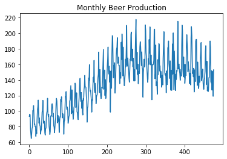

# Univariate Time Series

This article introduces a background of a univariate time series model including how to handle trend and seasonality in theory. A quick hyperparameter selection using ACF and PACF is also provided.

## Table of contents
{: .no_toc .text-delta }

1. TOC
{:toc}


## Autocovariance and Autocorrelation

1. Autocovariance or $\gamma_t$

$$\gamma_t = cov(Y_s, Y_{s+t}) = \mathbb{E}[(Y_s - \mu_s)(Y_{s+t} - \mu_{s+t})]$$

2. Autocorrelation of $\rho_t$

$$\rho_t = cor(Y_s, Y_{s+t}) = \frac{\gamma(Y_s, Y_{s+t})}{\sqrt{\gamma(Y_s, Y_s)\gamma(Y_{s+t}, Y_{s+t})}}$$

## White Noise


A stochatic process ${Y}$ is called white noise if 
* its elements are **uncorrelated**
* with mean $\mathbb{E}[Y] = 0$
* and variance $Var(Y) = \sigma^2$ fintie.

If the process is normally distributed, it is a `Gaussian White Noise`.

## Stationary

**High-level understanding**:

**(Strict Stataionay)** Any 2 finite subset of the stochastic process ${Y_t}$ taken from anywhere in the process must have the same distribution

**(Second order (weak) stationary)** Any 2 finite subset of the stochastic process ${Y_t}$ taken from anywhere in the process must have the same mean and autocovaraince i.e. **mean and variance do not dpeend on time point**.


Or see this comprehensive characteristics of stationary taken from this [article](https://towardsdatascience.com/machine-learning-part-19-time-series-and-autoregressive-integrated-moving-average-model-arima-c1005347b0d7)


## Correlogram

Correlograms are charts that show correlations of the values between 2 points in time. There are 2 important correlagrams in working with time series analysis.
1. **Autocorrelation Function** or `ACF` shows the correlation or $\rho_l$ where

$$\rho_l = cor(Y_t, Y_{t+l})$$

2. **Partial Autocorrelation Function** or `PACF` shows the correlation or $\rho_l$ conditioning on all values between time $t$ and $t-l$ where

$$\rho'_l = cor(Y_t, Y_{t+l}|Y_{t+1}, \ldots, Y_{t+l-1})$$


For instance, 
* $\rho_5$ in ACF can be read as: the correlation between any $Y$ in the series and $Y$ is 5 lags away from it is 0.1
* $\rho_2'$ in PACF can be read as: the correlation between any $Y$ in the series and $Y$ is 2 lags away from it, given $Y$ that is 1 lag away, is -0.3

## Autoregressive Model

An autoregressive model of order 1 or $AR(1)$ models a relationship where the mean adjusted value at time $t$ only depends on the mean adjusted value at time $t-1$

$$Y_t - \mu = \alpha(Y_{t-1}-\mu) + \epsilon_t$$

where $\epsilon_t$ is a *white noise* or the innovation. 

Likewise, an autoregressive process of order p or $AR(p)$ can be written as

$$$$
$$Y_t - \mu = \sum^p_{j=1}\alpha_j(Y_{t-j}-\mu) + \epsilon_t$$

That is, the mean adjusted value at time $t$ is a linear combination of the adjusted values from previous p lags and the white noise. 

The code below is taken and modified from this [website](http://www.blackarbs.com/blog/time-series-analysis-in-python-linear-models-to-garch/11/1/2016)


```python
import numpy as np
import pandas as pd
import matplotlib.pyplot as plt
%matplotlib inline
import statsmodels.api as sm
import statsmodels.tsa.api as smt
import scipy.stats as scs

def tsplot(y, ar_model, lags=None, figsize=(10, 8), style='bmh'):
    if not isinstance(y, pd.Series):
        y = pd.Series(y)
    with plt.style.context(style):    
        fig = plt.figure(figsize=figsize)
        #mpl.rcParams['font.family'] = 'Ubuntu Mono'
        layout = (2, 2)
        ts_ax = plt.subplot2grid(layout, (0, 0), colspan=2)
        acf_ax = plt.subplot2grid(layout, (1, 0))
        pacf_ax = plt.subplot2grid(layout, (1, 1))
#         qq_ax = plt.subplot2grid(layout, (2, 0))
#         pp_ax = plt.subplot2grid(layout, (2, 1))
        
        y.plot(ax=ts_ax)
        ts_ax.set_title('Time Series Analysis Plots ' +  ar_model)
        smt.graphics.plot_acf(y, lags=lags, ax=acf_ax, alpha=0.5)
        smt.graphics.plot_pacf(y, lags=lags, ax=pacf_ax, alpha=0.5)
#         sm.qqplot(y, line='s', ax=qq_ax)
#         qq_ax.set_title('QQ Plot')        
#         scs.probplot(y, sparams=(y.mean(), y.std()), plot=pp_ax)

        plt.tight_layout()
    return 

```

### Example of AR(1)


```python
## AR(1)
np.random.seed(1)
n_samples = 1000
alpha1 = 0.5
alpha2 = 0

## AR(1)
x = w = np.random.normal(size=n_samples)
for t in range(n_samples):
    x[t] = alpha1 * x[t-1] + alpha2 * x[t-2] + w[t]
    
    
tsplot(x, ar_model = 'AR(1)', lags=30)

```


### Example of AR(2)


```python

np.random.seed(1)
n_samples = 1000
alpha1 = 0.5
alpha2 = 0.3

## AR(2)
x = w = np.random.normal(size=n_samples)
for t in range(n_samples):
    x[t] = alpha1 * x[t-1] + alpha2 * x[t-2] + w[t]
    
    
tsplot(x, ar_model = 'AR(2)', lags=30)

```


* ACF of an AR model gradually decreases
* PACF of an AR model suddenly drop after p lags
    * it drops after lag 1 for AR(1) and after lag 2 for AR(2)
* Note that the PACF here starts from lag 0. Starting from lag 1 is common.

## Moving Average Model (MA)

A moving average model or MA models a relationship where the mean adjusted value at time $t$ only depends on previous and current white noise:

$$Y_t - \mu = \sum^q_{j=1}\beta_q \epsilon_{t-j} + \epsilon_t$$


```python
# Simulate an MA(1) process

n = int(1000)

# set the AR(p) alphas equal to 0
alphas = np.array([0.])
betas = np.array([0.6])

# add zero-lag and negate alphas
ar = np.r_[1, -alphas]
ma = np.r_[1, betas]

ma1 = smt.arma_generate_sample(ar=ar, ma=ma, nsample=n) 
_ = tsplot(ma1, 'MA(1)', lags=30)
```


* **ACF** of an AR model **suddenly drop** after q lags
    * it drops after lag 1 for MA(1)
* **PACF** of an AR model **gradually** decreases

## ARMA Model

An ARMA model is a combination of AR and MA. That is, the mean adjusted value at time $t$ depends on the mean adjusted values and the residuals from the past.

$$Y_t - \mu = \sum^p_{j=1}\alpha_p(Y_{t-j}-\mu) + \sum^q_{j=1}\beta_q \epsilon_{t-j} + \epsilon_t$$


```python
# Simulate an ARMA(1, 1) process

n = int(1000)

# set the AR(p) alphas equal to 0
alphas = np.array([0.4])
betas = np.array([0.6])

# add zero-lag and negate alphas
ar = np.r_[1, -alphas]
ma = np.r_[1, betas]

ma1 = smt.arma_generate_sample(ar=ar, ma=ma, nsample=n) 
_ = tsplot(ma1, 'ARMA(1, 1)', lags=30)
```


For ARMA, both ACF and PACF gradually decrease.

#### The summary of Time Series Processes' characteristics in correlograms

|  | AR(p) | MA(q) | ARMA(p,q) |
| :-: | :-: | :-: | :-: |
| ACF | Tail off | Sudden drop | Tail off  |
| PACF | Sudden drop | Tail off |  Tail off  |

Try plotting ACF and PACF first to see which model is the most suitable one. 

## D-fold differencing

* D-fold differencing is to remove **trend**. First contruct $X_t = Y_t - Y_{t-1}$ for 1-fold differencing. Then repeat the process on ${X}$ for 2-fold differencing and so on.

* D-fold differencing theoretically removes a polynomial trend of order $d$.

Aside
* there are more ways to detrend such as (i) subtracting rolling mean (ii) applying weighted moving average. 

## Lag-D differencing

* Lag-d differencing is to remove **seasonality**. For example, we can perform lag-4 difference on quarterly data. 


## ARIMA Model

Integrated ARMA (ARIMA) model is ARMA model that fits a series after d-fold differencing. 

\center
ARIMA(p, d, q) is ARMA(p,d) with d-fold differencing. That is, we perform d-fold differencing and fit ARMA(p,d)


## SARIMA Model

Seasonal ARIMA (SARIMA) model is ARIMA model that fits a series after lag-d and d-fold differencing to remove seasonality and trend. 


```python
beer = pd.read_csv('beer_production.csv')
```


```python
fig, ax = plt.subplots(1,1)
ax.plot(beer['Monthly beer production'])
ax.set_title('Monthly Beer Production')
```





```python
## detrend
detrended_beer = beer['Monthly beer production'] - beer['Monthly beer production'].shift(1)
_ = tsplot(detrended_beer[1:], '', lags=30)             

```


In ACF, there are strong autocorrelations with 12 and 24 lags, suggesting seasonality at every 12 months.


```python
## detrend
s_beer = beer['Monthly beer production'] - beer['Monthly beer production'].shift(12)
t_beer = s_beer - s_beer.shift(1)

_ = tsplot(t_beer[13:], 'deseason and detrend', lags=30)

```


Seasonality and trend are removed. But there are still some structures in ACF and PACF. 
